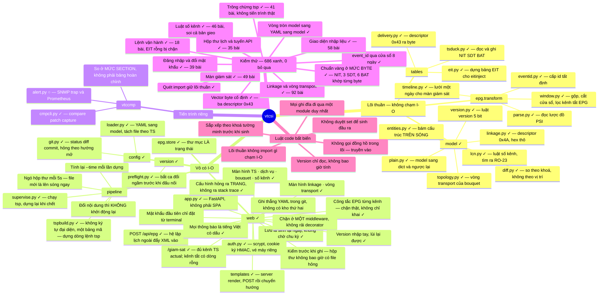
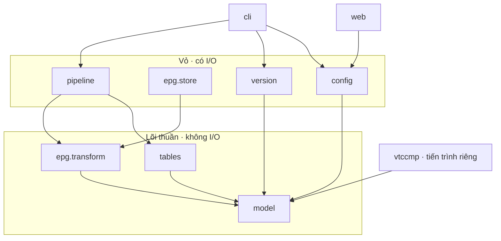
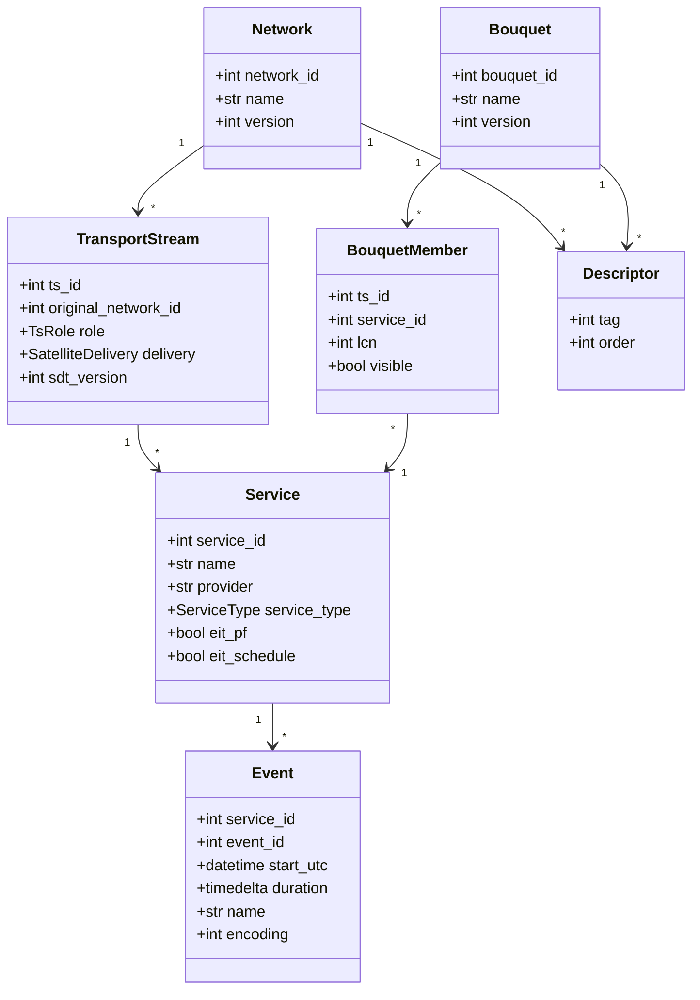

# Mindmap phần mềm — `vtcsi`

> Bản đồ **mã nguồn**. Toàn cảnh hệ thống ở [`mindmap.md`](mindmap.md); đặc tả ở [`spec.md`](spec.md) phiên bản **2.3**.
> Trạng thái: **809 test xanh, 0 bỏ qua** — kể cả bảy bài so byte. Lõi và đường ra sóng không phụ thuộc gói ngoài nào
> ngoài `pyyaml`; giao diện web là nhóm phụ thuộc tuỳ chọn `[web]`.

---

## 1. Bản đồ mã nguồn

Dấu ✓ là đã viết và có test; dấu ○ là chưa.



---

## 2. Cây thư mục

```
PSI-SI/
├── spec.md  mindmap.md  mindmap-software.md
├── refs/                        # chuẩn ETSI và DVB
├── Bang mau/                    # dữ liệu khảo sát và các bản dump
│   ├── dvb_tables_dump_win.xml  #   <- CHUẨN VÀNG: luồng SI thuần, 28 bảng
│   ├── dvb_tables_dump*.xml     #   bốn bản đầu ra mux
│   └── File xml đầu vào cho EPG.xml
│
├── pyproject.toml
├── config/                      # DỮ LIỆU, không phải code — nguồn sự thật
│   ├── network.yaml  services/  bouquets/
│   └── dau-ra.yaml               #   NGOÀI git — mỗi máy một địa chỉ (FR-86)
│
├── src/vtcsi/
│   ├── model/
│   │   ├── entities.py          ✓ thuần
│   │   └── output.py            ✓ thuần — địa chỉ ra, KHÔNG phải báo hiệu
│   ├── tables/
│   │   ├── delivery.py          ✓ thuần — descriptor 0x43
│   │   └── nit.py sdt.py bat.py xmlout.py
│   ├── epg/
│   │   ├── transform/
│   │   │   ├── parse.py         ✓ thuần
│   │   │   ├── eventid.py       ✓ thuần
│   │   │   └── window.py section.py
│   │   └── store.py             (có I/O)
│   ├── config/  version/  pipeline/  web/
│   └── cli.py
│
├── src/vtccmp/                  # bộ so sánh, cài đặt độc lập được
│   └── dump.py diff.py patch.py alert.py cmpcli.py
│
└── tests/
    ├── data/epg-sample.xml      ✓ fixture cắt từ file thật
    ├── test_delivery.py         ✓  8 bài
    ├── test_epg_parse.py        ✓ 16 bài
    ├── test_eventid.py          ✓ 16 bài
    └── test_purity.py           ✓  3 bài — quét cây import   [ tổng 43 ]
```

---

## 3. Ai được import ai

Mũi tên chỉ chiều cho phép. **Không có mũi tên nào đi ngược lên lõi thuần** — đó là toàn bộ ý nghĩa của sơ đồ này.



Rút gọn thành một câu: **`model`, `tables`, `epg.transform` không được import `os`, `pathlib`, `subprocess`, `requests`, và không được gọi `datetime.now`.**

`tests/test_purity.py` quét cây cú pháp và đánh trượt nếu vi phạm. Nó **đã được thử phá**: chèn `import os` cùng `datetime.now()` vào lõi thì hai bài đỏ với thông báo rõ ràng, gỡ ra thì xanh lại. Một bộ canh không bao giờ đỏ được chỉ là trang trí.

---

## 4. Mô hình dữ liệu



Ba điểm đáng chú ý.

**`Descriptor` là thực thể riêng có `order`**, không phải thuộc tính — vì thứ tự phát có ý nghĩa thật: `0x5F` phải đứng trước descriptor LCN.

**`lcn` nằm ở `BouquetMember`**, không ở `Service` — một kênh ở hai bouquet có thể mang hai số khác nhau, đúng cấu trúc BAT. Bản dump xác nhận: bouquet `0x6510` mang 78 LCN trải ba transport loop.

**`Event.event_id` để trống khi vừa phân tích xong.** `parse` không tự cấp số; `eventid.assign_all` mới làm. Tách ra để test được riêng, và để không ai lỡ dùng id của nguồn.

---

## 5. Ba tiến trình chạy

| Tiến trình | Làm gì | Mấy bản | Mạng container | Khởi động lại |
|---|---|---|---|---|
| `vtcsi run` | Sinh bảng và chạy `tsp` | Một cho mỗi nguồn | **host** — cần multicast ra | `unless-stopped`, **tách khỏi nhịp deploy** |
| `vtccmp run` | Đối chiếu và báo động | Một, máy nào cũng được | **host** — cần multicast vào | `unless-stopped` |
| `vtcsi web` | Giao diện nhập liệu | Một | bridge, có proxy | Coolify quản bình thường |

`Dockerfile` và `docker-compose.yml` đã có. Ảnh nền **trixie** vì TSDuck 3.44
chỉ phát hành gói `debian13`; phiên bản TSDuck **ghim tường minh**, vì tự nâng
là tự đổi byte trên sóng mà không ai duyệt. Gắn vào container là **cả kho git**
(`/repo`), không phải riêng `config/` — `git commit` cần `.git` đúng chỗ.

Lệnh mặc định của ảnh là `vtcsi validate`, **không phải** `run`: chạy một ảnh
mới mà nó lập tức bơm multicast vào mạng nhà đài là cách hỏng tệ nhất.

Container `vtcsi run` **không đặt CPU quota** — throttling của cgroup chèn khựng vào đúng chỗ cần đều nhịp.

---

## 6. Kiểm thử

| Lớp | Cách | Gắn với | Trạng thái |
|---|---|---|---|
| `tables.delivery` | Ba vector byte từ cấu hình thật, đã đối chiếu với sóng | AC-1 | ✓ 8 bài |
| `epg.transform.parse` | Fixture cắt từ file lịch thật, cộng chạy trên nguyên file 2 365 sự kiện | — | ✓ 16 bài |
| `epg.transform.eventid` | Nạp lại không đổi id; tám ngày liên tiếp không trùng | AC-14 | ✓ 16 bài |
| Luật code | `test_purity.py` quét cây import và lời gọi đồng hồ | — | ✓ 3 bài |
| Vòng tròn cấu hình | Model → YAML → model, và YAML → sóng đã gieo | AC-2 | ✓ 24 bài |
| `model.version` | Năm phán quyết, kể cả ca `đổi ngầm` | AC-3 | ✓ 23 bài |
| `epg.transform.window` | Gộp, cắt, loại chồng lấn, loại sự kiện quá 24 giờ | AC-8, RO-22 | ✓ 20 bài |
| `pipeline.tspbuild` | Mọi tuỳ chọn ghim từ `.adoc`, đối chiếu với `tsp` thật | AC-6 | ✓ 20 bài |
| `tables.eit` | Dựng EIT, định dạng BCD, một bảng mã duy nhất | AC-8 | ✓ 24 bài |
| Giao diện nhập liệu | Chạy trên bản sao `config/`; NIT bám SDT; lưu lại không xáo file | FR-3, FR-34…41 | ✓ 30 bài |
| `model.lcn` | Trùng số, ngoài dải, số mồ côi, báo động giả | FR-57, RO-23 | ✓ 46 bài |
| `pipeline.supervise` | Giãn cách, chết lặp, đổi nội dung không dựng lại | NFR-2 | ✓ 41 bài |
| `vtcsi refresh` · `run` | EIT rỗng không ghi đè; `--dry-run` dựng đúng lệnh; địa chỉ ra lấy từ file, `--to` đè lên | AC-6, FR-86 | ✓ 34 bài |
| `model.output` · `config.output` | Đọc IP, dải multicast, luật chặn và lời nhắc, vòng tròn ra đĩa | FR-86, FR-87 | ✓ 41 bài |
| Tăng version tự động | SDT và BAT tăng theo nội dung so với bản commit; NIT bằng tay; hai máy ra cùng số | FR-92 | ✓ 26 bài |
| Bộ container | `web` và `si` trỏ cùng thư mục; `si` chạy host network; không ghim địa chỉ vào ảnh | FR-90, FR-91 | ✓ 13 bài |
| Màn hình đầu ra | Địa chỉ hỏng không chạm đĩa; file cũ còn nguyên; nhánh `fork` hiện trong lệnh xem trước | FR-86…88 | ✓ 31 bài |
| `model.linkage` · `topology` | Hex, trần 248 byte, trùng lặp và thứ tự | FR-59…61, RO-8 | ✓ 51 bài |
| Màn hình linkage | Byte Irdeto qua biểu mẫu không suy suyển | FR-59, FR-60 | ✓ 41 bài |
| Màn hình bouquet | Gửi nguyên bảng số kênh; thao tác bị từ chối không ghi đĩa | FR-57 | ✓ 28 bài |
| Chuẩn vàng ở mức XML | So với `dvb_tables_dump_win.xml` | AC-2 | ✓ trong `test_roundtrip` |
| **Chuẩn vàng ở mức byte** | Cả hai cây XML qua `tstabcomp`, so chuỗi byte | AC-1, AC-2 | ✓ 7 bài — **khớp từng byte** |
| Tất định | Build cùng commit hai lần hai máy, so hash | AC-12 | ○ |
| Độc lập | Giết `vtccmp`, hai nguồn vẫn phát | AC-13 | ○ |
| Nguội | Tắt nguồn kia, khởi động lại từ máy tắt | AC-11 | ○ |

Bốn dòng `○` cuối **không phải là việc lập trình**: chúng cần TSDuck cài thật,
hai máy, và một bản dump mới. Kế hoạch leo từng bậc ở
[`kiem-thu-thuc-te.md`](kiem-thu-thuc-te.md).

---

## 7. Sáu luật code không được phá

1. **Lõi thuần không chạm I/O.** `model`, `tables`, `epg.transform` chỉ nhận dữ liệu vào và trả dữ liệu ra.
2. **Không gọi đồng hồ trong lõi.** Thời điểm hiện tại là *tham số truyền vào*. Không có luật này thì không test được, và không tất định được.
3. **Sắp xếp theo khoá tường minh** trước mọi lần sinh đầu ra.
4. **Không duyệt `set` để sinh đầu ra.** Thứ tự lặp của nó không ổn định.
5. **Version chỉ đọc, không bao giờ tính.** Không hash, không đếm, không tăng tự động.
6. **Mọi ghi đĩa đi qua một module duy nhất.**

Luật 2, 3, 4 nghe vụn vặt nhưng cả ba phục vụ đúng một điều: hai thực thể ngang hàng cùng commit phải cho ra cùng byte. Đó là cơ chế đồng bộ của hệ này — mất nó là mất luôn mô hình dự phòng.

---

## 8. Hai cái bẫy đã trả giá để biết

**`event_id` của nguồn không dùng được.** Đo trên file lịch thật: giữ nguyên id nguồn thì trong cửa sổ 8 ngày, **16 555 trên 18 920 sự kiện bị nuốt** — 87,5 %. Có một bài test tên `test_source_ids_would_collide` chứng minh vấn đề tồn tại, đặt ngay trước bài chứng minh cách chữa. Nguồn sửa cách đánh số thì bài đó đỏ và báo cho ta biết.

**`tstables` mặc định chỉ xuất bảng hoàn chỉnh.** Năm bản dump đều trống phần EIT schedule, khiến tôi kết luận nhầm rằng Barrowa không phát nó — trong khi StreamXpert soi cùng luồng thấy đủ `day 0..3` và `day 4..7` ở 139 kbps. Dấu hiệu lẽ ra phải nhận ra sớm: thứ duy nhất vắng mặt lại đúng là bảng có chu kỳ dài nhất.

Hệ quả thẳng vào thiết kế: **`vtccmp/diff.py` phải so ở mức section**, không chờ bảng hoàn chỉnh. Một bộ giám sát chờ bảng hoàn chỉnh sẽ mù đúng ở chỗ chiếm 87 % tải SI — và mù im lặng, không báo lỗi gì.
