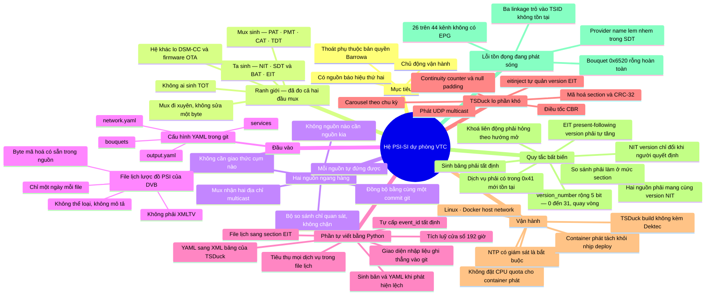
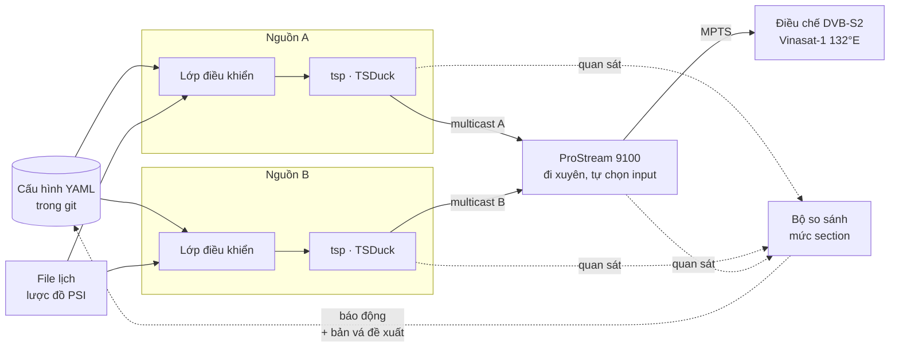
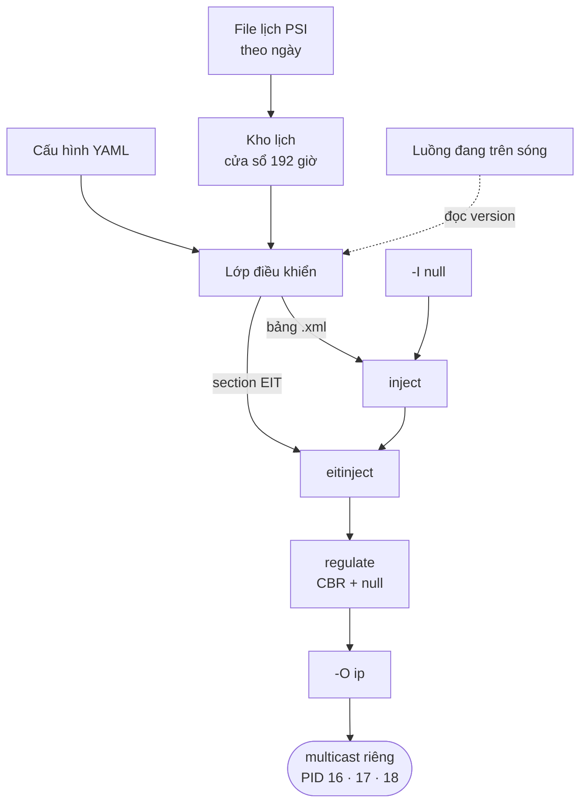

# Bản đồ hệ thống PSI/SI dự phòng — VTC

> Đồng bộ với `spec.md` phiên bản **0.9**. Bản đồ mã nguồn ở [`mindmap-software.md`](mindmap-software.md).
> Mermaid render được trên GitHub và trong VS Code với extension *Markdown Preview Mermaid Support*.

---

## 1. Bản đồ toàn hệ

---

## 2. Cấu trúc hai nguồn ngang hàng

Điểm cần nhìn thấy: **không có mũi tên nào nối Nguồn A với Nguồn B**. Chúng giống nhau vì cùng đọc một commit và cùng chạy một hàm thuần, không phải vì trao đổi với nhau.

Ở **giai đoạn chuyển tiếp**, Nguồn A là Barrowa. Nó không đọc được git và không biết Nguồn B tồn tại — nên mọi thay đổi phải áp hai nơi: commit vào git, và thao tác tay trên giao diện Barrowa. Ở **giai đoạn ổn định**, cả hai nguồn đều là hệ mới và cùng đọc một commit.

---

## 3. Đường đi của dữ liệu, trong một nguồn

---

## 4. Ghi chú cho những nút không tự giải thích

| Nút | Vì sao nó ở đó |
|---|---|
| **Mux đi xuyên, không sửa một byte** | Đã đo hai đầu: 10 bảng cấu trúc — NIT, ba SDT, sáu BAT — **trùng khít từng trường kể cả version**, qua bốn bản dump trải bốn ngày. Không còn là suy luận. |
| **Không ai sinh TOT** | Mux có TDT chu kỳ 4 s mang UTC, nhưng **không bảng nào** mang `local_time_offset_descriptor`. Đầu thu hiện đúng giờ Việt Nam nhờ đâu là câu hỏi nghiệp vụ còn bỏ ngỏ. |
| **Không cần giao thức cụm nào** | Barrowa phải có discovery multicast và ba cổng riêng vì hai máy của nó ghi vào cùng một đích — chính giao thức đó đẻ ra tình trạng *config changed on both*. Ở đây mux làm việc chọn, nên cả lớp lỗi split-brain biến mất cùng giao thức. |
| **Đồng bộ bằng cùng một commit git** | Không có heartbeat giữa hai nguồn. Chúng giống nhau vì tính tất định: cùng đầu vào, cùng hàm thuần, cùng byte. |
| **Tự cấp `event_id` tất định** | Nguồn đánh số lại từ 64000 cho mỗi dịch vụ mỗi ngày. Đo trên file thật: giữ nguyên id nguồn thì **87,5 %** sự kiện trong cửa sổ 8 ngày bị nuốt. Và không được dùng bộ đếm vì hai nguồn phải ra cùng số. |
| **Tiêu thụ mọi dịch vụ trong file lịch** | Barrowa phải gán nguồn thủ công cho từng dịch vụ và bỏ quên 26 kênh. Hệ mới làm ngược lại: lấy hết, muốn loại thì ghi tường minh. |
| **So sánh phải làm ở mức section** | Bài học đắt: `tstables` mặc định chỉ xuất bảng hoàn chỉnh, nên năm bản dump đều trống phần EIT schedule dù nó có thật trên sóng ở 139 kbps. Một bộ so sánh chờ bảng hoàn chỉnh sẽ mù đúng ở chỗ chiếm 87 % tải SI. |
| **Khoá liên động phải hỏng theo hướng mở** | Không đọc được nguồn kia thì vẫn phát. Mất tham chiếu không phải bằng chứng mình sai — và nếu nguồn kia vừa chết thì đó chính là lúc mình cần phát nhất. |
| **Dịch vụ phải có trong `0x41` mới tồn tại** | Tài liệu quy tắc VTC: đầu thu chỉ lưu dịch vụ có mặt trong `service_list_descriptor` sau khi dò. Vì vậy descriptor này phải sinh tự động, không cho gõ tay. |

---

## 5. Con số — tất cả đều đo được, không phải chép từ cấu hình

| | |
|---|---|
| Mạng | `network_id` 12901 · tên `VTC` · Vinasat-1 132,0°E |
| Transport stream | 3 — **chỉ TSID 8 mang ONID 12901**, tức của VTC |
| Kênh của VTC | **64** trên TSID 8: 44 truyền hình + 20 phát thanh |
| TS mạng khác | TSID 3 (14 kênh) và TSID 1000 (10 kênh), đều ONID 1 |
| Bouquet trên sóng | 6 — `0x3622` `0x6510` `0x6520` `0x6550` `0x6604` `0x0044` |
| LCN | 87 mục, biến thể **NorDig v1** |
| PID 16 · NIT | 2,9 kbps |
| PID 17 · SDT + BAT | 18,8 kbps |
| PID 18 · EIT | **139 kbps — 86,5 % tải SI** |
| EPG phủ | **18 trên 44** kênh truyền hình |
| Độ sâu EPG | 8 ngày: `day 0..3` và `day 4..7` |

### Version đang trên sóng — giá trị gieo cho YAML

| Bảng | v | | Bảng | v |
|---|---:|---|---|---:|
| NIT | **4** | | BAT `0x3622` | **18** |
| SDT TSID 8 | **9** | | BAT `0x6510` | **26** |
| SDT TSID 3 | **12** | | BAT `0x6520` | **27** |
| SDT TSID 1000 | **19** | | BAT `0x6550` | **2** |
| | | | BAT `0x6604` | **13** |
| | | | BAT `0x0044` | **10** |

Giống hệt nhau ở cả bốn bản dump trải bốn ngày — cấu hình rất ổn định, đúng điều kiện mà mô hình đồng bộ bằng git cần.

---

## 6. Đã đo và chưa đo

Phân biệt này quan trọng: một kết luận rút từ bản đo sai cách cũng sai như đoán mò.

| Đã đo trực tiếp | Còn suy luận hoặc chưa đo |
|---|---|
| Mux đi xuyên nguyên vẹn NIT/SDT/BAT | Mux có giới hạn bitrate PID 18 không |
| Ba descriptor `0x43` khớp vector kiểm thử | Mux làm gì khi mất luồng SI đầu vào |
| LCN là NorDig v1 | Đầu thu lấy lệch giờ `+07:00` từ đâu |
| Payload linkage Irdeto `0x80` `0x82` `0x09` | `running_status` của EIT schedule trên sóng |
| EIT chỉ có `short_event_descriptor` | Cấu trúc segment của EIT schedule Barrowa đang phát |
| Mux sinh TDT, không ai sinh TOT | |
| Version của cả 10 bảng cấu trúc | |
| EPG chỉ phủ 18 trên 44 kênh | |

Ba dòng đầu cột phải đều đóng được bằng **một phép thu duy nhất**: `tstables --pid 18 --all-sections` chạy hai phút, cộng một lần rút cáp trong giờ thấp điểm.
